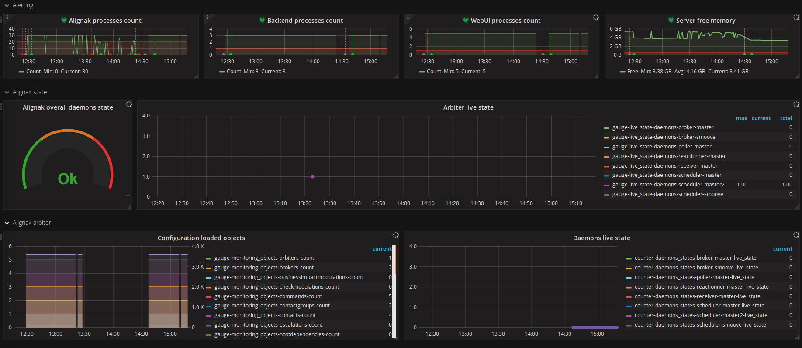
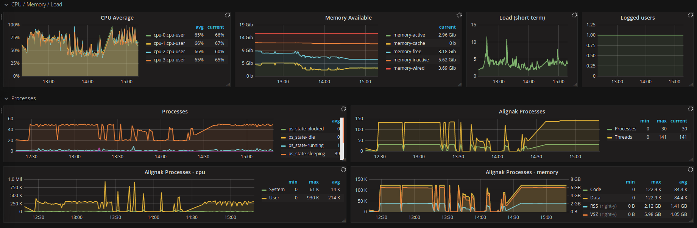

=======================
Alignak collectd plugin
=======================

Alignak daemons have an HTTP json API that allows to get information about the daemons status. Especially, the arbiter daemon has an endpoint providing many useful data to be aware of the global Alignak framework status.

Thanks to `collectd <https://collectd.org/>`_, some metrics can be easily collected and provided to a graphite database. Then a smart `Grafana <https://grafana.com/>`_ dashboard allows to have a nice interface to monitor your Alignak instance :)

Installation
------------

Install the `collectd <https://collectd.org/>`_ daemon on your system according to the project documentation.

A `collectd.conf` example file is available in the same directory as this doc file.

Configuration
-------------

Alignak processes monitoring
~~~~~~~~~~~~~~~~~~~~~~~~~~~~

The running Alignak daemons may be monitored thanks to the `collectd processes` plugin.
::

    LoadPlugin processes

    ...

    <Plugin processes>
        ProcessMatch "alignak" "python: alignak-.*"
        ProcessMatch "alignak-backend" "uwsgi --ini /my_configuration_root/etc/alignak-backend/uwsgi.ini"
        ProcessMatch "alignak-webui" "uwsgi --ini /my_configuration_root/etc/alignak-webui/uwsgi.ini"
    </Plugin>

Use a *ProcessMatch* directive to get the Alignak daemons processes. The former example is a valid example for an Alignak installation on a FreeBSD server.

The first *ProcessMatch* directive get all the launched Alignak daemons: processes which name starts with `python2.7: alignak-`

The second *ProcessMatch* directive get all the launched Alignak backend uWsgi workers: processes which name matches with the started uWsgi command. And the third one is the same for the Alignak Web UI uWsgi workers.

Alignak daemons monitoring
~~~~~~~~~~~~~~~~~~~~~~~~~~

The Alignak arbiter Web services expose an endpoint `/stats` that contain much information about the currently running daemons and their state. It also exposes the system live synthesis containing global counters about the hosts and services states.

The `collectd curl_json` plugin allows to fetch these information to feed Graphite.

 ::

    LoadPlugin curl_json

    <Plugin curl_json>
        # Alignak objects count
        <URL "http://localhost:7770/stats">
            Instance "monitored_objects"
            <Key "counters/*">
                Type "gauge"
            </Key>
        </URL>
        # Alignak daemons livestate
        <URL "http://localhost:7770/stats">
            Instance "livestate"
            <Key "livestate/daemons/*">
                Type "gauge"
            </Key>
            <Key "livestate/state">
                Type "gauge"
            </Key>
        </URL>
        <URL "http://localhost:7770/livesynthesis">
            Instance "livesynthesis"
            <Key "livesynthesis/_overall/livesynthesis/*">
                Type "counter"
                Type "gauge"
            </Key>
        </URL>
    </Plugin>

The plugin gets the Alignak overall status on the arbiter endpoint: *http://localhost:7770/stats* and it extracts:

    - the objects counters (monitored objects)
    - the daemons live state, as provided by the daemons
    - the overall live state as computed by the arbiter with the daemons live state synthesis

To help understanding what is available from the collectd plugin, here is a commented example output from an Alignak arbiter */stats* endpoint:

.. code-block:: json

    {
        // Daemon information
        "type": "arbiter",
        "name": "arbiter-master",
        "alignak": "My Alignak",
        "version": "1.1.0",
        "spare": false,
        "load": 0.5518187512729743,
        "program_start": 1519303245.322687,

        // Configuration objects loaded by the arbiter
        "monitoring_objects": {
            "servicesextinfo": {"count": 0}, "businessimpactmodulations": {"count": 0}, "hostgroups": {"count": 2}, "escalations": {"count": 0}, "schedulers": {"count": 3}, "hostsextinfo": {"count": 0}, "contacts": {"count": 4}, "servicedependencies": {"count": 0}, "resultmodulations": {"count": 0}, "servicegroups": {"count": 1}, "pollers": {"count": 1}, "arbiters": {"count": 1}, "receivers": {"count": 1}, "macromodulations": {"count": 0}, "reactionners": {"count": 1}, "contactgroups": {"count": 2}, "brokers": {"count": 2}, "realms": {"count": 2}, "services": {"count": 0}, "commands": {"count": 5}, "notificationways": {"count": 4}, "timeperiods": {"count": 3}, "modules": {"count": 5}, "checkmodulations": {"count": 0}, "hosts": {"count": 0}, "hostdependencies": {"count": 0}
        },

        "metrics": [],

        // Alignak overall live state
        // 0: ok, 1: warning, 2: critical
        // The ouput field contain detailed information in case of any problem
        "live_state": {
            "daemons": {
                "scheduler-master2": 0, "poller-master": 0, "receiver-master": 0, "broker-other_realm": 0, "reactionner-master": 0, "scheduler-master": 0, "scheduler-other_realm": 0, "broker-master": 0
            },
            "timestamp": 1519303315,
            "state": 0,
            "output": "all daemons are up and running."
        },

        // The daemon loaded modules
        "modules": {},

        // The detailed daemon state as provided by the daemons to the arbiter
        "daemons_states": {
            "poller-master": {
                "passive": false, "live_state": 0, "live_output": "poller/poller-master is up and running.", "reachable": true, "uri": "http://127.0.0.1:7771/", "alive": true, "realm_name": "All", "manage_sub_realms": true, "spare": false, "polling_interval": 5, "active": true, "configuration_sent": false, "max_check_attempts": 3, "last_check": 1519303314.140798
            },
            "receiver-master": {
                "passive": false, "live_state": 0, "live_output": "receiver/receiver-master is up and running.", "reachable": true, "uri": "http://127.0.0.1:7773/", "alive": true, "realm_name": "All", "manage_sub_realms": true, "spare": false, "polling_interval": 5, "active": true, "configuration_sent": false, "max_check_attempts": 3, "last_check": 1519303311.394887
            },
            "broker-master": {
                "passive": false, "live_state": 0, "live_output": "broker/broker-master is up and running.", "reachable": true, "uri": "http://127.0.0.1:7772/", "alive": true, "realm_name": "All", "manage_sub_realms": true, "spare": false, "polling_interval": 5, "active": true, "configuration_sent": false, "max_check_attempts": 3, "last_check": 1519303314.147649
            },
            "broker-other_realm": {
                "passive": false, "live_state": 0, "live_output": "broker/broker-other_realm is up and running.", "reachable": true, "uri": "http://127.0.0.1:17772/", "alive": true, "realm_name": "other_realm", "manage_sub_realms": true, "spare": false, "polling_interval": 5, "active": true, "configuration_sent": false, "max_check_attempts": 3, "last_check": 1519303314.166824
            },
            "reactionner-master": {
                "passive": false, "live_state": 0, "live_output": "reactionner/reactionner-master is up and running.", "reachable": true, "uri": "http://127.0.0.1:7769/", "alive": true, "realm_name": "All", "manage_sub_realms": true, "spare": false, "polling_interval": 5, "active": true, "configuration_sent": false, "max_check_attempts": 3, "last_check": 1519303314.130823
            },
            "scheduler-master": {
                "passive": false, "live_state": 0, "live_output": "scheduler/scheduler-master is up and running.", "reachable": true, "uri": "http://127.0.0.1:7768/", "alive": true, "realm_name": "All", "manage_sub_realms": false, "spare": false, "polling_interval": 5, "active": true, "configuration_sent": true, "max_check_attempts": 3, "last_check": 1519303311.402276
            },
            "scheduler-master2": {
                "passive": false, "live_state": 0, "live_output": "scheduler/scheduler-master2 is up and running.", "reachable": true, "uri": "http://127.0.0.1:37768/", "alive": true, "realm_name": "All", "manage_sub_realms": false, "spare": false, "polling_interval": 5, "active": true, "configuration_sent": true, "max_check_attempts": 3, "last_check": 1519303311.407367
            },
            "scheduler-other_realm": {
                "passive": false, "live_state": 0, "live_output": "scheduler/scheduler-other_realm is up and running.", "reachable": true, "uri": "http://127.0.0.1:17768/", "alive": true, "realm_name": "other_realm", "manage_sub_realms": false, "spare": false, "polling_interval": 5, "active": true, "configuration_sent": true, "max_check_attempts": 3, "last_check": 1519303311.413731
            }
        },

        // Duplicate information ... may be ignored ;)
        "counters": {
            "servicesextinfo": 0, "businessimpactmodulations": 0, "hostgroups": 2, "resultmodulations": 0, "escalations": 0, "dispatcher.receivers": 1, "dispatcher.pollers": 1, "schedulers": 3, "hostsextinfo": 0, "contacts": 4, "servicedependencies": 0, "external-commands": 0, "servicegroups": 1, "pollers": 1, "broks": 5, "arbiters": 1, "receivers": 1, "macromodulations": 0, "reactionners": 1, "contactgroups": 2, "brokers": 2, "realms": 2, "services": 0, "dispatcher.arbiters": 1, "dispatcher.reactionners": 1, "dispatcher.schedulers": 3, "commands": 5, "notificationways": 4, "timeperiods": 3, "modules": 5, "checkmodulations": 0, "dispatcher.brokers": 2, "hosts": 0, "hostdependencies": 0
        }
    }

Grafana dashboard
-----------------

An example Grafana dashboard is available in the same directory as this doc file.

Screen captures:

