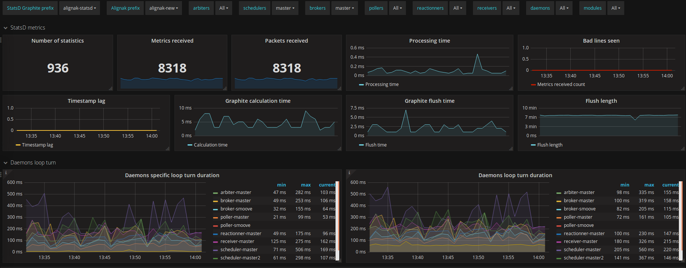
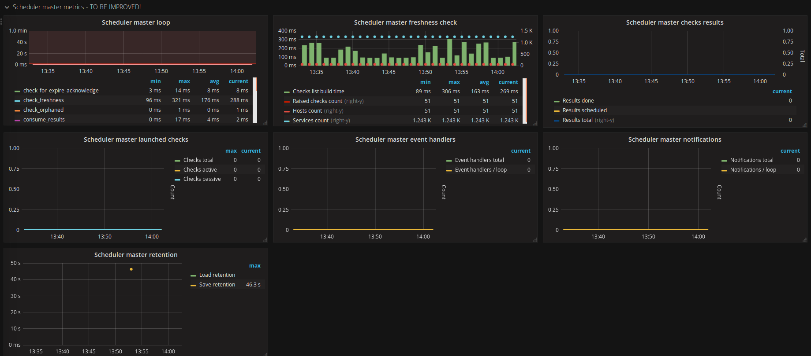
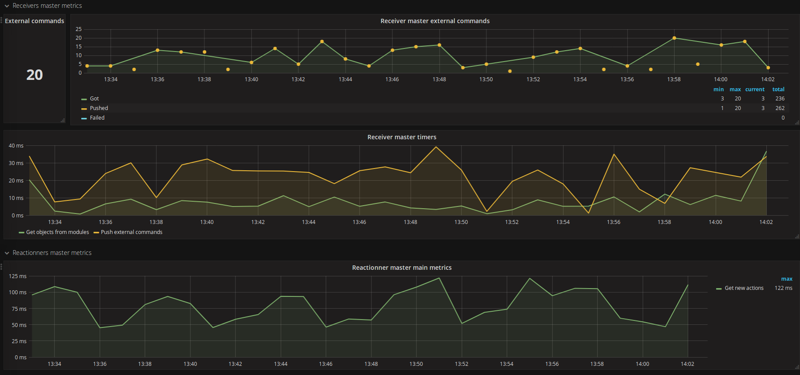
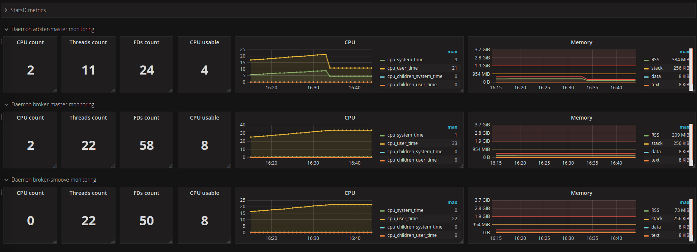

===============
Alignak Grafana
===============

Alignak is able to send some internal metrics to a StatsD daemon. The internal metrics allow to have a lot of information about the Alignak daemons health and load.

Configuration
-------------

Alignak inner statistics
~~~~~~~~~~~~~~~~~~~~~~~~

In the *alignak.ini* configuration file, set the ``statsd_enabled`` configuration variable and configure the other `statsd` prefixed variables according to your StatsD configuration (host, port and prefix).

An example Grafana dashboard (*Grafana_dashboard-Alignak_internal_metrics.json*) is available in the same directory as this doc file to view the Alignak daemons collected metrics.

Alignak daemons monitoring
~~~~~~~~~~~~~~~~~~~~~~~~~~

Defining the ``ALIGNAK_DAEMON_MONITORING`` environment variable will make each Alignak daemon add some debug log to inform about its own CPU and memory consumption.

On each activity loop end, if the report period is happening, the daemon gets its current cpu and memory information from the OS and log these information formatted as a Nagios plugin output with performance data. The default report period is set to 10 loop turn (eg. 10 seconds). As such, each 10 loop turn, there is a cpu/memory log. If then environment variable contains an integer value, this value will define the log period in loop count. Defining ``ALIGNAK_DAEMON_MONITORING`` with ``5`` will make a log each 5 loop turn.

If Alignak is configured to notify its inner statistics to a StatsD daemon, the collected metrics will also be sent to StatsD.

An example Grafana dashboard (*Grafana_dashboard-Alignak_daemons_monitoring.json*) is available in the same directory as this doc file to view the Alignak daemons collected metrics.

